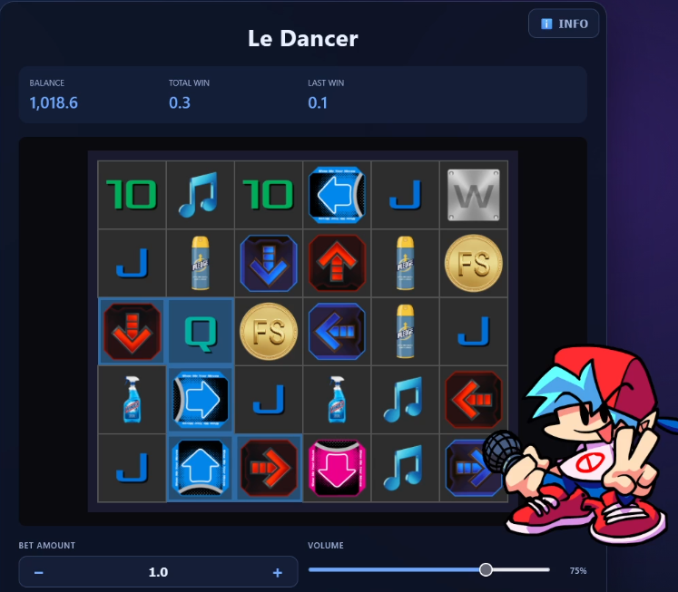

# Slot Machine - Le Dancer

A dance-game-themed slot with game mechanics borrowed from "Le Bandit".



## Note
This is an **educational/demo project**, not intended for real gambling.

## RTP
The current RTP is tuned to give the player back a bit more than they spend, on average. Ideally these would be about 96%. 
There is a test in this repo that runs a few modes 10K times and reports the following:

```
┌─────────┬────────────────┬───────┬──────────┬───────────┬───────────────┬─────────────────────┬──────────┬────────────┬─────────────────┐
│ (index) │ Mode           │ Runs  │ Cost/Run │ RTP       │ Hit Rate (>0) │ Profit Rate (>Cost) │ Avg Win  │ Max Win    │ Nat. Bonus Freq │
├─────────┼────────────────┼───────┼──────────┼───────────┼───────────────┼─────────────────────┼──────────┼────────────┼─────────────────┤
│ 0       │ 'Base Game'    │ 10000 │ '1.00'   │ '135.44%' │ '21.69%'      │ '8.66%'             │ '1.35'   │ '3260.80'  │ '1 in 141'      │
│ 1       │ '3-scatter'    │ 10000 │ '100.00' │ '102.23%' │ '86.90%'      │ '23.52%'            │ '102.23' │ '10039.30' │ 'N/A'           │
│ 2       │ '4-scatter'    │ 10000 │ '250.00' │ '111.09%' │ '95.58%'      │ '25.34%'            │ '277.73' │ '10731.60' │ 'N/A'           │
└─────────┴────────────────┴───────┴──────────┴───────────┴───────────────┴─────────────────────┴──────────┴────────────┴─────────────────┘
```

## Quick Start

### Prerequisites
- Node.js 16+ (for development)
- Modern browser (Chrome, Firefox, Safari, Edge)

### Installation

```bash
# Install dependencies
npm install

# Start development server
npm run dev

# Open browser to http://localhost:5173
```

### Local build options

```bash
# Normal local build
npm run build

# Simulate GitHub Pages base path locally (bash)
VITE_BASE_PATH=/slot/ npm run build

# Simulate GitHub Pages base path locally (PowerShell)
$env:VITE_BASE_PATH='/slot/'
npm run build
```

### Tests

```
npm run test
npm test -- src/games/luckyscape/rtpBenchmark.test.js
```

## Backend (Deno Deploy)

This repo now includes a backend scaffold in `backend/` for daily credits and leaderboards.

### Frontend env

Set API base URL for real backend mode:

```bash
# .env.local
VITE_API_BASE_URL=https://<your-deno-deploy-url>
```

### Backend local run

```bash
# Requires Deno 2+ (task includes --unstable-kv for Deno KV)
deno task --config backend/deno.json dev
```

See `backend/README.md` for endpoint details and deploy steps.
