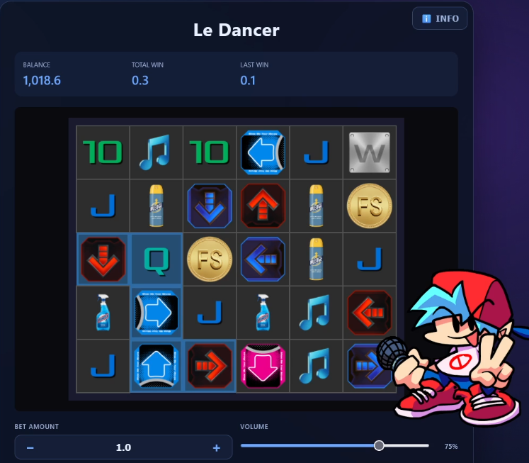

# Slot Machine - Le Dancer

A dance-game-themed slot with game mechanics borrowed from "Le Bandit".

A backend service running on Deno Deploy tracks user wins (based on hashed IP-address, no registration). All of the game logic is handled in the front end, so recorded wins could be manipulated.



## Note
This is an **educational/demo project**, not intended for real gambling.

## RTP
The current RTP is tuned to give the player back a bit more than they spend, on average. Ideally these would be about 96%. 
There is a test in this repo that runs a few modes 10K times and reports the following:

```
Starting isolated benchmarks (10000 runs each)...
Mode         | Runs  | Cost/Run | RTP     | Hit Rate (>0) | Profit Rate (>Cost) | Avg Win | Max Win  | Nat. Bonus Freq
-------------+-------+----------+---------+---------------+---------------------+---------+----------+----------------
Base Game    | 10000 | 1.00     | 108.36% | 24.06%        | 5.28%               | 1.08    | 714.60   | 1 in 128       
LEPRECHAUN   | 10000 | 100.00   | 114.89% | 91.65%        | 28.60%              | 114.89  | 10006.80 | N/A
GLITTER_GOLD | 10000 | 250.00   | 117.07% | 96.88%        | 27.10%              | 292.68  | 20002.20 | N/A

Base Game Scatter Frequency                                                                                                                        
Outcome    | Hits | Frequency | Odds     
-----------+------+-----------+----------                                                                                                          
3 Scatters | 75   | 0.75%     | 1 in 133
4 Scatters | 3    | 0.03%     | 1 in 3333
5 Scatters | 0    | 0.00%     | Never
```

```sh
npm test -- src/games/luckyscape/rtpBenchmark.test.js
```

## Quick Start

### Prerequisites
- Node.js 16+ (for development)
- Modern browser (Chrome, Firefox, Safari, Edge)

### Installation

```bash
# Install dependencies
npm install

# Start development server
npm run dev

# Open browser to http://localhost:5173
```

### Local build options

```bash
# Normal local build
npm run build

# Simulate GitHub Pages base path locally (bash)
VITE_BASE_PATH=/slot/ npm run build

# Simulate GitHub Pages base path locally (PowerShell)
$env:VITE_BASE_PATH='/slot/'
npm run build
```

### Tests

```
npm run test
npm test -- src/games/luckyscape/rtpBenchmark.test.js
```

## Backend (Deno Deploy)

This repo now includes a backend scaffold in `backend/` for daily credits and leaderboards.

### Frontend env

Set API base URL for real backend mode:

```bash
# .env.local
VITE_API_BASE_URL=https://<your-deno-deploy-url>
```

### Backend local run

```bash
# Requires Deno 2+ (task includes --unstable-kv for Deno KV)
deno task --config backend/deno.json dev
```

See `backend/README.md` for endpoint details and deploy steps.
